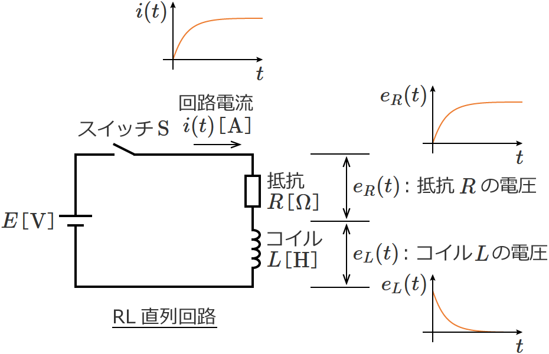
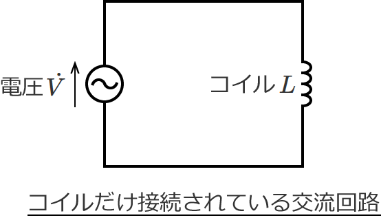
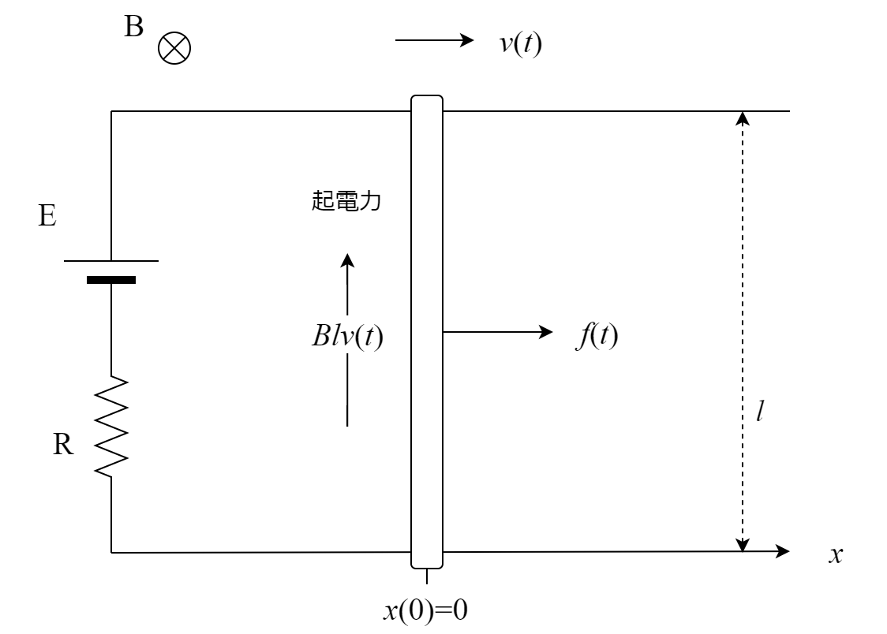

# 回路素子

| 素子 | 関係式        |
| ---- | ------------- |
| 抵抗 | $$V_R = R I_R$$ |
| キャパシタ | $$V_C = \frac{1}{C} Q, I_C = \frac{d Q}{dt}$$ |
| コイル | $$V_L = L \frac{d I_L}{dt}$$ |

注意点として、電圧と電流の向きは図のように逆で成立する関係式である。
そのため、電流の向きと電流の向きが同じ場合は$-$をつけて対応する。
<center>
    
    基本関係
</center>

# 例: コイルの過渡応答

<center>
    
    RL回路の図 [1]より
</center>

コイルの電圧$V_L$は回路を時計回りを正とする電流$I$を用いて$V_L = L \frac{d I}{dt}$と書ける。
キルヒホッフの法則より、次の$I$に関する微分方程式を得る。
$$
    E - IR - V_L = 0\\
    \Leftrightarrow - L \frac{d I}{dt} = R I - E
$$
得られた微分方程式は次のように変数分離形にして解くことができる。
$$
\frac{d I}{dt} = - \frac{R}{L}( I - \frac{E}{R} )\\
\frac{1}{ I - \frac{E}{R}} dI = - \frac{R}{L} dt\\
\log |I - \frac{E}{R}| = - \frac{R}{L} t + C\\
\therefore I(t) = C e^{ - \frac{R}{L} t} + \frac{E}{R}
$$
$I(0) = 0$とすれば$C = - \frac{E}{R}$を得るので
$$
    I(t) = \frac{E}{R} (1 - e^{ - \frac{R}{L} t})
$$
となる。よってコイルの電圧は次のように求まる。
$$
V_L(t) = L \frac{dI}{dt} = L \frac{E}{R} \frac{R}{L} e^{ - \frac{R}{L} } = E e^{ - \frac{R}{L} }
$$

# 例: 交流回路におけるコイル

時計回りを電流の正方向として考える。
※$\dot{V} = E \sin \omega t$ の意味
<center>
    
    コイルのみが繋がれた交流回路 [2]より
</center>

キルヒホッフの法則より
$$
    E \sin \omega t - V_L = 0\\
    E \sin \omega t = L \frac{d I}{dt}\\
    \therefore I = - \frac{E}{\omega L} \cos \omega t + C
$$
よってコイルの電流の位相が電源に比べて$\frac{\pi}{2}$だけ遅れていることがわかる。

# 例: 導体棒の運動

次のような図における、導体棒の位置$x(t)$を求める。

<center>
    
    導体棒の運動
</center>

導体棒の速度$v(t) := \frac{dx}{dt}$とすれば、図中時計回りを正とする電流$I(t)$を用いてキルヒホッフの法則より
$$
    E - Bl v(t) - R I(t) = 0        \\
    \Leftrightarrow I(t) = - \frac{Bl}{R} ( v(t) - \frac{E}{Bl} )
$$
一方で導体棒が受ける力$f$は$f(t) = Bl I(t)$であるから、導体棒の運動方程式は次式で与えられる。
$$
    m \frac{dv}{dt} = Bl I(t)
$$
よって次の$v$に関する微分方程式を得る。
$$
    \frac{dv}{dt} = - \frac{(Bl)^2}{mR} ( v(t) - \frac{E}{Bl} )
$$

### 定常解析

定常状態、すなわち加速度が0の状態$\Leftrightarrow \frac{dv}{dt} = 0$における速度を求めてみる。
これは$\frac{dv}{dt} = 0$を微分方程式に代入すればよく
定常速度$v_{\infty} = \frac{E}{Bl}$を簡単に得ることができる。

### 微分方程式を解く

これは変数分離で簡単に解くことができて、次の解を得る。
$$
    v(t) = C e^{- \frac{(Bl)^2}{mR} t} + \frac{E}{Bl}
$$
$v(0) = 0$とすれば任意定数$C$は定まり、次の解を得る。
$$
    v(t) = \frac{E}{Bl}(1 - e^{- \frac{(Bl)^2}{mR} t})
$$
以下はそのグラフを図示したもの。点線は定常状態の速度を表す。

```python {cmd matplotlib hide}
import numpy as np
import matplotlib.pyplot as plt

E = 10
B = 10
l = 1
m = 1
R = 10

t = np.arange(0, 20, 0.1)
v = E / (B*l) * (1 - np.exp( - (B*l)**2 / (m*R) * t ))
plt.plot(t, v)
plt.xlabel("time")
plt.ylabel(r"$v(t)$")
plt.hlines([E / (B*l)], t[0], t[-1], linestyle="dashed", color="gray")
plt.show()
```

位置$x(t)$は次のようにして求められる。
$$
    x(t) = \int_0^t v(t) \mathrm{d}t + x(0) = \int_0^t \frac{E}{Bl}(1 - e^{- \frac{(Bl)^2}{mR} t}) \mathrm{d}t = \frac{E}{Bl} \{
        t + \frac{mR}{(Bl)^2} e^{- \frac{(Bl)^2}{mR} t} - \frac{mR}{(Bl)^2}
    \}
$$
以下はそのグラフを図示したもの。点線は定常状態(加速度0)の位置の変化を表す。
```python {cmd matplotlib hide}
import numpy as np
import matplotlib.pyplot as plt

E = 10
B = 10
l = 1
m = 1
R = 10

t = np.arange(0, 50, 0.1)
temp = m*R/(B*l)**2
x = E / (B*l) * (
    t + 1 / temp * np.exp(- temp * t) - 1 / temp
)
plt.plot(t, x)
plt.plot(t, E / (B*l) * (t - 1 /temp), color="gray", linestyle="dashed")
plt.xlabel("time")
plt.ylabel(r"$x(t)$")
plt.show()
```

# まとめ

電磁気学は高校物理ではかなりの部分がイメージの説明となり、数式による理解が通常できない。
しかし微分方程式を通じて、数式による理解をすることが可能になる。
是非使ってほしい。

# 参考

[1] [RL直列回路の過渡現象の解き方](https://eleking.net/study/s-transient/str-transient-rl.html)
[2] [交流回路の電圧と電流の計算とベクトル図（コイルだけの回路）](https://eleking.net/study/s-accircuit/sac-vi-l.html)
[3] [誘導起電力とローレンツ力](https://www.yukimura-physics.com/entry/elemag27)
