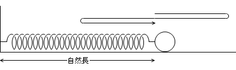
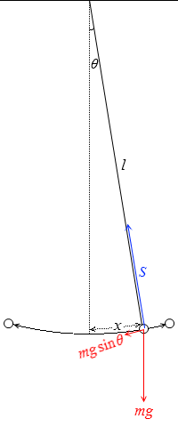
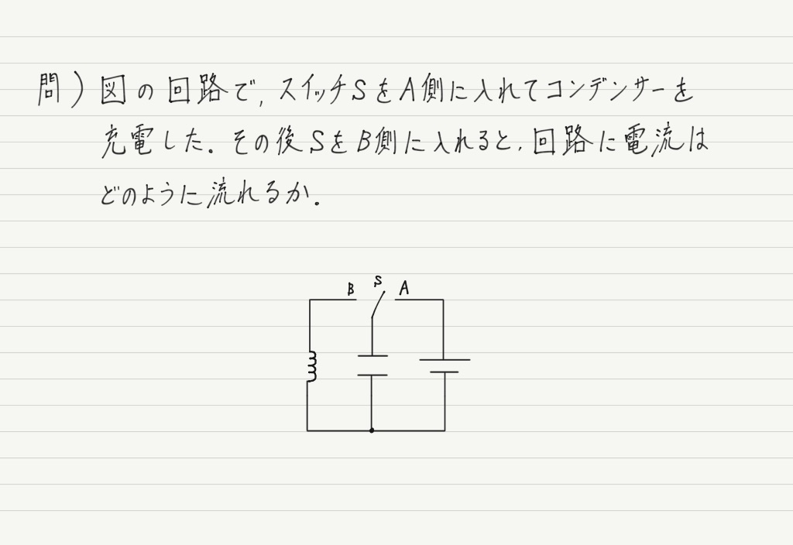
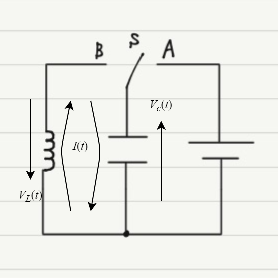
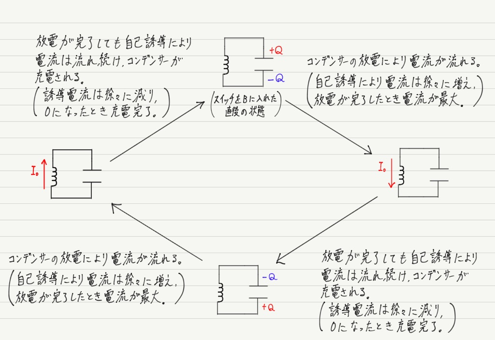

# 運動方程式

運動方程式は物体の質量$m$, 加速度$a$, 力(の合力)$f$として次式で与えられた。
$$
    ma = f
$$
しかしこの表現は微分方程式を隠したもので、本当は物体の時刻$t$における位置$x(t)$を用いて一般には次式で表現される。
$$
    m \frac{d^2 x}{dt^2} = f(t)
$$

## 例: 等加速度直線運動

質量$m$の物体が、摩擦も空気抵抗もない1次元空間にある。
不思議な力で$x$軸正方向に常に$f(t) = F$の力で引っ張られると、物体の運動方程式は次式で与えられる。
$$
    m \frac{d^2 x}{dt^2} = F
$$
ここで速度$v := \frac{dx}{dt}$とすれば、運動方程式は1階微分方程式となる。
$$
    m \frac{dv}{dt} = F
$$
この解は両辺を$\int_{0}^{t}$で積分することで速度の解を得る。
$$
    v(t) = \frac{F}{m} t + v(0)
$$
更に速度は$v = \frac{dx}{dt}$であったから、位置$x$の解も求まる。
$$
    \frac{dx}{dt} = \frac{F}{m} t + v(0)\\
    x(t) = \frac{1}{2} \frac{F}{m} t^2 + v(0) t + x(0)
$$

なおこの解は、高校物理学では公式で与えられていた変位に関する公式$x = v_0 t + \frac{1}{2} a t^2$を表している。($a = \frac{F}{m}$で一定であるので。)

## 2階微分方程式への誘い

簡単な力学の問題は、位置の二階微分$\frac{d^2 x}{dt^2}$を速度の1階微分$\frac{dv}{dt}$として解くことができるが、通常はそううまくはいかない。
次の図のような、質量$m$の物体が摩擦も空気抵抗もない空間で水平につながれている問題を考える。

    </img>
    単振動の問題の概念図 [1]より

ばねのばね定数を$k$、物体の自然長時の位置からの距離(変位)を$x$とすると、運動方程式は次式で表される。
$$
    m \frac{d^2 x}{dt^2} = - kx
$$
この方程式は先の例題と同様には解くことができない。この資料では、これを解くことができるようになることを目標とする。

# 2階微分方程式の性質

次のような一般形で表される2階微分方程式(2階線形斉次微分方程式)を考える。
$$
    \frac{d^2 x}{dt^2} + f(t) \frac{dx}{dt} + g(t) x = 0
$$
このような方程式では、特殊解$x = x_1(t), x_2(t)$が見つかりかつ$x_1(t), x_2(t)$が1次独立であれば、一般解は$C_1, C_2$を任意の定数として次で与えられる。
$$
    x(t) = C_1 x_1(t) + C_2 x_2(t)
$$
ここで特殊解とは方程式を満たす解の1つのことである。
また1次独立は次のようなロンスキアン$W$で判定を行う。
$$
    \text{$x_1, x_2$が1次独立} \Leftrightarrow W(x_1, x_2) \neq 0\\
    W(x_1, x_2) := x_1 \frac{d x_2}{dt} - x_2 \frac{d x_1}{dt}
$$
例えば$W(\cos t, \sin t) \neq 0$が簡単に確認できるので、$\cos, \sin$は1次独立であるといえる。

# 単振動型微分方程式

ここでは次のような2階微分方程式を考える。
$$
    \frac{d^2 x}{dt^2} = - \omega^2 x
$$
ここで$\omega$は正定数である。
この形の微分方程式は先のセクションで述べたように、特殊解を得られればそれで解を構成することができる。
2階微分すると自分自身に戻ってくる方程式とみなすことができることに注目すると、次のような特殊解を得ることができる。

$$
    x_1(t) = \cos \omega t\\
    x_2(t) = \sin \omega t
$$

念のためロンスキアンを計算すると、$W(\cos \omega t, \sin \omega t) \neq 0$が確認できる。
従って解は次で与えられる。
$$
    x(t) = C_1 \cos \omega t + C_2 \sin \omega t
$$
或いは三角関数の合成をもちいて、次の形でも表現できる。
$$
    x(t) = A \sin(\omega t + \alpha)
$$
これは振幅$A$, 角振動数$\omega$の単振動に他ならない。

## 例: 水平ばね

[2階微分方程式への誘い](#2階微分方程式への誘い)で述べた微分方程式は次式であった。
$$
    m \frac{d^2 x}{dt^2} = - kx     \\
    \Leftrightarrow \frac{d^2 x}{dt^2} = - \frac{k}{m} x
$$
これは$\omega := \sqrt{ \frac{k}{m} }$とすれば単振動型微分方程式に他ならない。
つまり角振動数$\omega$、即ち周期$T = \frac{2 \pi}{\omega} = 2 \pi \sqrt{ \frac{m}{k} }$の単振動であることがわかる。

## 例: 単振り子

    
    単振り子の問題の概念図 [1]より

$\theta$が十分小さいと仮定すると、$\sin \theta \approx \theta$を用いて次の運動方程式を得る。
$$
    m \frac{d^2 x}{dt^2} = - \frac{mg}{l} x\\
    \Leftrightarrow \frac{d^2 x}{dt^2} = - \frac{g}{l} x
$$
これは$\omega := \sqrt{ \frac{g}{l} }$とすれば単振動に他ならない。
周期は$T = \frac{2 \pi}{\omega} = 2 \pi \sqrt{ \frac{l}{g} }$である。

## LC共振

    
    LC共振の問題の回路図 [2]より

ただし電源の電圧は$E$, コンデンサの静電容量は$C$, コイルのインダクタンスは$L$とする。

ここで時刻$t$について、$t = 0$のタイミングでSがB側に入ったとする。
コンデンサにたまっている電荷$Q(t)$について$Q(0) = CE$である。

    
    電圧等の文字設定 [2]に加筆

なおコンデンサでは電気量$Q$と電流$I$の間には次の関係がある(電流の定義は単位時間当たりの電気量)。ただしこの例では電気量が減少して電流が流れ始めるという関係があるため、符号が$-$になる。
$$
    I = - \frac{d Q}{dt}
$$

キルヒホッフの法則より
$$
    V_C(t) - V_L(t) = 0
$$
ここで$V_C(t)$は
$$
    V_C = \frac{1}{C} Q
$$
であり、$V_L(t)$は電気量と電流の関係を用いて
$$
    V_L = - L \frac{d I}{dt} = - L \frac{d^2 Q}{dt}
$$
と表される。これらを代入して次式の$Q$に関する微分方程式を得る。
$$
    \frac{1}{C} Q = - L \frac{d^2 Q}{dt}    \\
    \Leftrightarrow \frac{d^2 Q}{dt} = - \frac{1}{CL} Q
$$
$\omega := \sqrt{ \frac{1}{CL} }$とすればこの微分方程式の解は次式で与えられる。
$$
    Q(t) = C_1 \cos \omega t + C_2 \sin \omega t
$$
$Q(0) = CE$より$C_1 = CE$を得る。
また電流$I(t) = - \frac{d Q}{dt}$より、電流は次式で与えられる。
$$
    I(t) = \omega C_1 \sin \omega t - \omega C_2 \cos \omega t
$$
明らかに$I(0) = 0$であるから、$C_2 = 0$を得る。
以上より電流は
$$
    I(t) = \omega CE \cos \omega t = E \sqrt{ \frac{C}{L} } \cos \omega t
$$
と求まり、振動(共振)する。共振角周波数$\omega = \sqrt{ \frac{1}{CL} }$であり、共振の周期は$\frac{2 \pi}{\omega} = 2\pi \sqrt{CL}$である。

※言葉で説明すると次のようになる。

    
    LC共振の問題言葉での説明 [2]より

# まとめ

単振動型微分方程式
$$
    \frac{d^2 x}{dt^2} = - \omega^2 x
$$
は次のような解で表すことができる。
$$
    x(t) = C_1 \cos \omega t + C_2 \sin \omega t\\
    x(t) = A \sin(\omega t + \alpha)
$$
これは振幅$A$, 角振動数$\omega$の単振動に他ならない。

この知識があれば、振動が関係する話では微分方程式を立てることで角振動数$\omega$を求めることができるため、周期などを覚える必要がなくなる。是非結論だけでも覚えておいてほしい。

# 参考

[1] [わかりやすい高校物理の部屋](https://wakariyasui.sakura.ne.jp/p/mech/tann/banehuriko.html)
[2] [物理と微分積分](https://www.yukimura-physics.com/entry/guide10)
